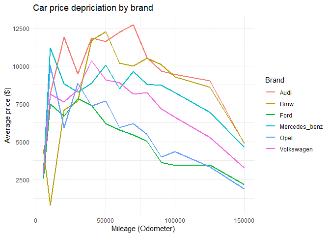
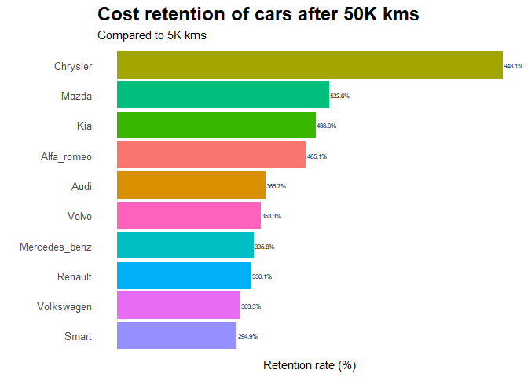
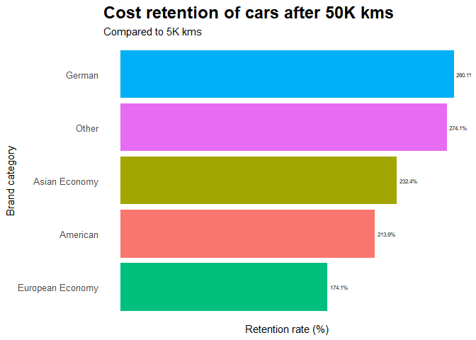
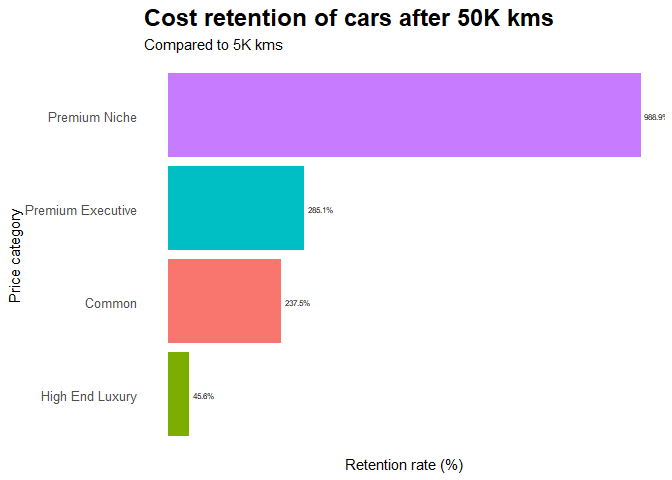
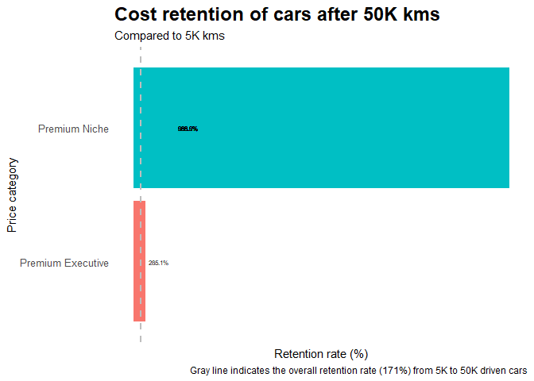
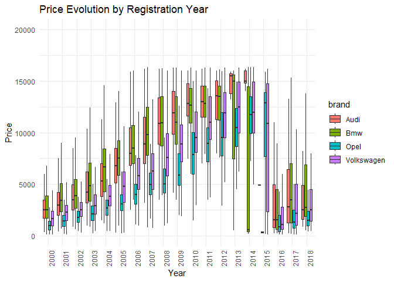
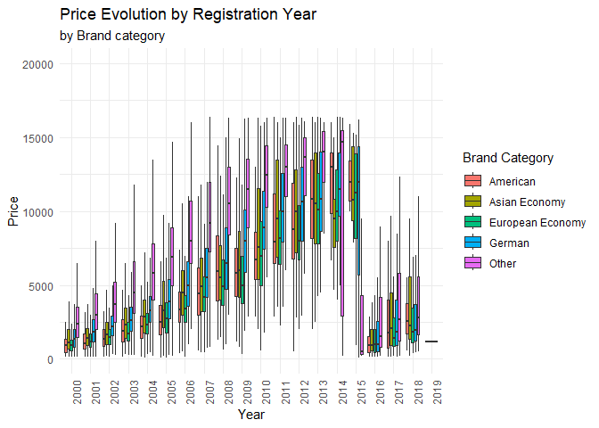

German Used Car Market: Valuation & Depreciation Analysis
================
Ankur
2026-05-27

## 1. Executive Summary

This project analyzes over 50,000 used car listings from eBay
Kleinanzeigen in Germany. The goal is to identify how mileage, brand
positioning, and vehicle age interact to determine a vehicle’s value
retention.

## 2. Setup

We initialize our required libraries and dataset.

## 3. Exploring & Cleaning

We initialize our required libraries and clean the raw strings (removing
currency symbols and distance metrics) to establish a structured data.

The variables ‘gearbox’ and ‘notRepairedDamage’ have a BLANK category.
It is not NA. It is not having any name. Price and Odometer variables
are encoded as character type. There are categories with names in
German. Year of registration looks abnormal. It starts from 1000 and
goes till 9999. Might be typos. Needs correction.

There were outliers in Price variable that is removed using IQR values
(for high outlying values) and lower outliers by manually setting the
price greater than 100.

## 4. Analysis

# Top 6 brands

| brand         |
|:--------------|
| Volkswagen    |
| Opel          |
| Bmw           |
| Mercedes_benz |
| Audi          |
| Ford          |

# Top 6 brands’ cost against their mileage

| brand         | odometer |      cost |
|:--------------|---------:|----------:|
| Audi          |     5000 |  3176.850 |
| Audi          |    10000 |  8179.800 |
| Audi          |    20000 | 11919.421 |
| Audi          |    30000 |  9464.647 |
| Audi          |    40000 | 11832.071 |
| Audi          |    50000 | 11616.353 |
| Audi          |    60000 | 12219.212 |
| Audi          |    70000 | 12706.000 |
| Audi          |    80000 | 10541.245 |
| Audi          |    90000 |  9681.107 |
| Audi          |   100000 |  9437.575 |
| Audi          |   125000 |  9030.000 |
| Audi          |   150000 |  4866.170 |
| Bmw           |     5000 |  4476.212 |
| Bmw           |    10000 |   810.250 |
| Bmw           |    20000 |  7073.087 |
| Bmw           |    30000 |  7673.556 |
| Bmw           |    40000 | 11665.364 |
| Bmw           |    50000 | 12279.083 |
| Bmw           |    60000 | 10179.842 |
| Bmw           |    70000 |  9989.694 |
| Bmw           |    80000 | 10494.838 |
| Bmw           |    90000 | 10089.239 |
| Bmw           |   100000 |  9260.662 |
| Bmw           |   125000 |  8580.221 |
| Bmw           |   150000 |  4910.055 |
| Ford          |     5000 |  2554.366 |
| Ford          |    10000 |  7505.444 |
| Ford          |    20000 |  6674.028 |
| Ford          |    30000 |  7840.865 |
| Ford          |    40000 |  7379.081 |
| Ford          |    50000 |  6192.492 |
| Ford          |    60000 |  5768.102 |
| Ford          |    70000 |  5433.384 |
| Ford          |    80000 |  5023.733 |
| Ford          |    90000 |  3613.464 |
| Ford          |   100000 |  3424.338 |
| Ford          |   125000 |  3468.697 |
| Ford          |   150000 |  2166.220 |
| Mercedes_benz |     5000 |  2998.023 |
| Mercedes_benz |    10000 | 11200.000 |
| Mercedes_benz |    20000 |  8830.000 |
| Mercedes_benz |    30000 |  8280.778 |
| Mercedes_benz |    40000 |  8843.333 |
| Mercedes_benz |    50000 | 10067.739 |
| Mercedes_benz |    60000 |  8493.600 |
| Mercedes_benz |    70000 |  9629.880 |
| Mercedes_benz |    80000 |  8784.778 |
| Mercedes_benz |    90000 |  8725.844 |
| Mercedes_benz |   100000 |  8221.912 |
| Mercedes_benz |   125000 |  6930.991 |
| Mercedes_benz |   150000 |  4641.379 |
| Opel          |     5000 |  2741.202 |
| Opel          |    10000 | 10013.500 |
| Opel          |    20000 |  5916.216 |
| Opel          |    30000 |  8867.870 |
| Opel          |    40000 |  7355.174 |
| Opel          |    50000 |  7694.128 |
| Opel          |    60000 |  5943.988 |
| Opel          |    70000 |  6197.105 |
| Opel          |    80000 |  5468.524 |
| Opel          |    90000 |  3974.830 |
| Opel          |   100000 |  4333.777 |
| Opel          |   125000 |  3324.036 |
| Opel          |   150000 |  1879.106 |
| Volkswagen    |     5000 |  2996.827 |
| Volkswagen    |    10000 |  8152.882 |
| Volkswagen    |    20000 |  7613.042 |
| Volkswagen    |    30000 |  8438.745 |
| Volkswagen    |    40000 | 10338.846 |
| Volkswagen    |    50000 |  9088.581 |
| Volkswagen    |    60000 |  8893.606 |
| Volkswagen    |    70000 |  8129.301 |
| Volkswagen    |    80000 |  8232.919 |
| Volkswagen    |    90000 |  7151.000 |
| Volkswagen    |   100000 |  6626.783 |
| Volkswagen    |   125000 |  5287.824 |
| Volkswagen    |   150000 |  3258.678 |

## 5. Visualization

<!-- --><!-- --><!-- --><!-- --><!-- --><!-- --><!-- -->

## Summary

The analysis of top 6 brands shows that the cost of car depreciates
faster after 50,000 kms. The price retention is at peak at nearby 50,000
kms. Audi is the brand that shows highest price retention among all the
top 6 brands.

In the entire list of over 50K cars, Chrysler retains highest value
after running for 50K kms. Among the top 10 cars retaining most of their
prices after 50K kms run, cars listed in top 6 most sold brands are
Audi, Mercedes, and Volksvagen.

German cars retain most of their cost, and European economy cars the
least.

Premium niche cars are expensive and also the have the highest price
retention rate. Surprisingly, the high end luxury cars depreciate the
most.

## Conclusion

**The 50,000 KM Valuation Cliff:** Across all major market segments,
vehicle pricing experiences a sharp, non-linear depreciation
acceleration once mileage crosses the **50,000 km** threshold. This
represents the optimal liquidation window for consumers looking to exit
their vehicles with maximum value retention.

**Premium Brand Resilience:** Within our high-volume tier (Top 6
Brands), **Audi** demonstrates the most robust price insulation,
consistently holding a premium valuation across both registration year
increments and high-mileage bands compared to direct competitors like
BMW and Mercedes-Benz.

**Macro-Category Dynamics:** While niche segments like *Chrysler* show
high isolated peaks at specific milestones, the **German Mainstream**
tier provides the most reliable statistical stability over time, making
them the safest asset class for secondary market dealerships managing
inventory turnover.
